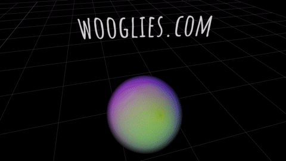

# What this is

This is an experimental project that explores the state of online collaboration tech: multiplayer snapshot interpolation, reliable WebRTC connections, positional audio, WebXR, audio reactivity and others.

It also explores combining raymarching fragment shaders with rasterized scenes, enabling the rendering of soft and fuzzy 'wooglies' - players.

This project was built as a way to learn and experiment with collaborative tech and, as a result, is now a collection of useful solutions for certain common and less common problems in this space (i.e. connecting a WebRTC stream to WebAudio to enable positional audio, using https for WebXR development, or integrating a raymarched shader into a rasterized scene by generating a depth buffer, and so on), so I hope it is useful at least because of that.

It is built primarily with [`react-three-fiber`](https://github.com/pmndrs/react-three-fiber), [`drei`](https://github.com/pmndrs/drei) and [`react-xr`](https://github.com/pmndrs/react-xr), but it also depends on a number of other great [packages](https://github.com/jure/wooglies/blob/main/package.json). There is _a lot_ of [`Three.js`](https://github.com/mrdoob/three.js) code sprinkled around. The project also required PRs to Three itself [[1](https://github.com/mrdoob/three.js/pull/21268), [2](https://github.com/mrdoob/three.js/pull/21183)].

The first version/prototype was publicly released on February 28th 2021.

All of the code (with the exception of the included fragment shaders, which come with their own individual licenseses) is licensed under the MIT license, so you're welcome to take and use what you need, according to the terms of the license.

# What this isn't

This is not a well-documented well-structured bulletproof production ready application that you can pick up and transport to your environment.

# Progress

In [PROGRESS.md](PROGRESS.md) you'll find progress screenshots in chronological order, from the first unlit pair of cubes to the current state.

# Contributions

Are very welcome!

# Installation

`npm install` and `npm run dev` should do the trick - the application will then be accessible on `https://localhost:8080`. Be sure to configure a `.env` file with `TWILIO_ACCOUNT_SID`, `TWILIO_AUTH_TOKEN`, as the application depends on Twilio's STUN/TURN servers.

# Useful references

https://github.com/somikdatta/cuckoo
https://github.com/AidanNelson/threejs-webrtc
https://github.com/coding-with-chaim/group-video-final
https://discourse.threejs.org/t/positionalaudio-setmediastreamsource-with-webrtc-question-not-hearing-any-sound/14301/25

# Thanks

* Thank you @mjurczyk for your help with 3rd-person camera!
* Thank you Leon Denise (author of the [awesome volumetric shader](https://www.shadertoy.com/view/3ltyRB)), for letting me use and experiment with your shader! 
* All of the contributors to all of the open source projects this depends on! :bow:

